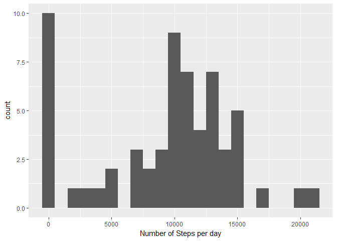
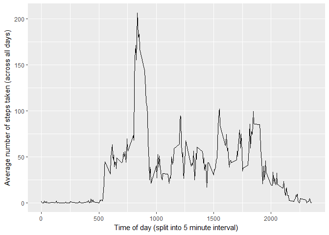
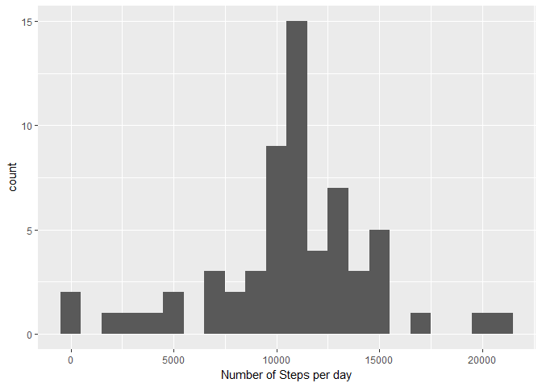
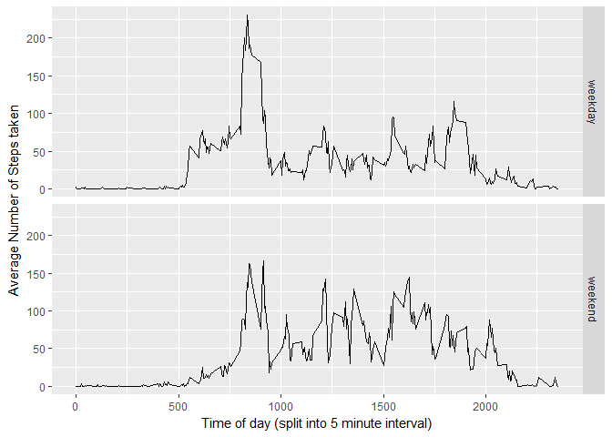

# Reproducible Research: Peer Assessment 1


## Loading and preprocessing the data

Read in the file.  There is header data, so use header = TRUE.


```r
dt <- read.csv("./activity.csv", header = TRUE)
```

Initial look at the data


```r
str(dt)
```

```
## 'data.frame':	17568 obs. of  3 variables:
##  $ steps   : int  NA NA NA NA NA NA NA NA NA NA ...
##  $ date    : Factor w/ 61 levels "2012-10-01","2012-10-02",..: 1 1 1 1 1 1 1 1 1 1 ...
##  $ interval: int  0 5 10 15 20 25 30 35 40 45 ...
```


For later analysis - create an additional column that combines "date"" and "interval" columns
into a new column "datetime"


```r
x <- formatC(dt$interval, width = 4, format = "d", flag = "0")
dt$datetime <- as.POSIXct(strptime(paste(dt$date, x), "%Y-%m-%d %H%M"))
```

Check the date range for "datetime" - should be 2 months (from 1 October 2012 to 30 November 2012).  We can ignore the timezone here.


```r
range(dt$datetime)
```

```
## [1] "2012-10-01 00:00:00 MYT" "2012-11-30 23:55:00 MYT"
```

"steps"" is OK to leave as an int.
Now we have


```r
str(dt)
```

```
## 'data.frame':	17568 obs. of  4 variables:
##  $ steps   : int  NA NA NA NA NA NA NA NA NA NA ...
##  $ date    : Factor w/ 61 levels "2012-10-01","2012-10-02",..: 1 1 1 1 1 1 1 1 1 1 ...
##  $ interval: int  0 5 10 15 20 25 30 35 40 45 ...
##  $ datetime: POSIXct, format: "2012-10-01 00:00:00" "2012-10-01 00:05:00" ...
```

## What is mean total number of steps taken per day?

Calculate the total number of steps per day.  Ignore NA values - i.e. they
won't count in the "steps per day" tally for that day.


```r
library(dplyr)
x <- group_by(dt, date)
steps_per_day <- summarise(x, steps_per_day = sum(steps, na.rm = TRUE))
```

#### Histogram of Number of Steps per Day


```r
library(ggplot2)
c <- ggplot(steps_per_day, aes(steps_per_day))
c + geom_histogram(binwidth = 1000) + labs(x = "Number of Steps per day")
```

<!-- -->

Calculate and report the mean and median of the total number of steps taken per day


```r
mean(steps_per_day$steps_per_day)
```

```
## [1] 9354.23
```

```r
median(steps_per_day$steps_per_day)
```

```
## [1] 10395
```


## What is the average daily activity pattern?


Five minute interval on the x-axis ...
Average number of steps taken (across all days) on the y-axis


```r
x <- group_by(dt, interval)
steps_per_interval <- summarise(x, average = mean(steps, na.rm = TRUE))
```


Now plot this ...


```r
d <- ggplot(steps_per_interval, aes(interval, average))
d + geom_line() + labs(x = "Time of day (split into 5 minute interval)", y = "Average number of steps taken (across all days)")
```

<!-- -->

Which 5-minute interval, on average across all the days in the dataset, contains the
maximum number of steps ?


```r
steps_per_interval[which.max(steps_per_interval$average),]
```

```
## # A tibble: 1 × 2
##   interval  average
##      <int>    <dbl>
## 1      835 206.1698
```

## Imputing missing values

Calculate and report the total number of missing values in the dataset (i.e. the total number of rows with NAs)


```r
summary(dt)
```

```
##      steps                date          interval     
##  Min.   :  0.00   2012-10-01:  288   Min.   :   0.0  
##  1st Qu.:  0.00   2012-10-02:  288   1st Qu.: 588.8  
##  Median :  0.00   2012-10-03:  288   Median :1177.5  
##  Mean   : 37.38   2012-10-04:  288   Mean   :1177.5  
##  3rd Qu.: 12.00   2012-10-05:  288   3rd Qu.:1766.2  
##  Max.   :806.00   2012-10-06:  288   Max.   :2355.0  
##  NA's   :2304     (Other)   :15840                   
##     datetime                  
##  Min.   :2012-10-01 00:00:00  
##  1st Qu.:2012-10-16 05:58:45  
##  Median :2012-10-31 11:57:30  
##  Mean   :2012-10-31 11:57:30  
##  3rd Qu.:2012-11-15 17:56:15  
##  Max.   :2012-11-30 23:55:00  
## 
```

Note that there are 2304 NA values in the "step" column, however no NAs appear
in the "date" or "interval" column.

To fill the missing value, use the mean value (across all days) for that 5-minute interval.


```r
x <- dt[is.na(dt$steps),]
for(i in 1:nrow(x)) {
        x[i,"steps"] = steps_per_interval[steps_per_interval$interval == x[i,"interval"], "average"] 
}
dt$filled_steps <- dt$steps
dt$filled_steps[as.numeric(rownames(x))] <- x$steps
```

Histogram of total number of steps taken each day


```r
x <- group_by(dt, date)
steps_per_day2 <- summarise(x, steps_per_day = sum(filled_steps, na.rm = TRUE))
```

#### Histogram of Number of Steps per Day


```r
library(ggplot2)
c <- ggplot(steps_per_day2, aes(steps_per_day))
c + geom_histogram(binwidth = 1000) + labs(x = "Number of Steps per day")
```

<!-- -->

Calculate and report the mean and median total number of steps taken per day.


```r
mean(steps_per_day2$steps_per_day)
```

```
## [1] 10766.19
```

```r
median(steps_per_day2$steps_per_day)
```

```
## [1] 10766.19
```

Do these values differ from the estimates from the first part of the assignment ?


```r
mean_diff <- round(mean(steps_per_day2$steps_per_day) - mean(steps_per_day$steps_per_day), 3)
print(mean_diff)
```

```
## [1] 1411.959
```

```r
median_diff <- round(median(steps_per_day2$steps_per_day) - median(steps_per_day$steps_per_day), 3)
print(median_diff)
```

```
## [1] 371.189
```

What is the impact of imputing missing data on the estimates of the total daily number of steps ?

Per the calculation, the mean value has increased by 1411.959

The median value has increased by 371.189

This is expected.  In the earlier analysis, the NA values were treates as zeros.
In the later analysis, they are given positive values, so the mean & median will increase.


## Are there differences in activity patterns between weekdays and weekends?

Create a new factor variable (day_type) with two levels "weekday" and "weekend"


```r
dt$weekday <- weekdays(dt$datetime)
dt$day_type <- ifelse( (dt$weekday == "Saturday" | dt$weekday == "Sunday"), "weekend", "weekday")
dt$day_type <- as.factor(dt$day_type)
```

Now create a panel plot


```r
x <- group_by(dt, day_type, interval)
steps_per_day3 <- summarise(x, average = mean(filled_steps))
```


```r
e <- ggplot(steps_per_day3, aes(interval, average) )
e + geom_line() + facet_grid(steps_per_day3$day_type ~ .) + labs(x = "Time of day (split into 5 minute interval)", y = "Average Number of Steps taken")
```

<!-- -->

The most obvious difference is that activity starts later in the day on weekends than it does on a weekday.
